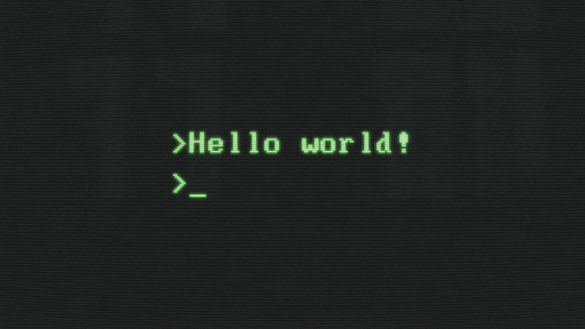

## Who I am:
I am a computer science student at Rice University.

Ever since I started making video games as a kid, I have been addicited to programming. I have branched off into developing apps, websites, and even deep learning research. I am turning my passion for computers into a full fledged career.
## What I am currently doing:
My current main projects are co-leading the development of match for RiceApps and continuing a deep learning phylogenetic project with the Rice Computer Science Department.
## What I am looking for:
I am currently looking for an internship or research position for Summer 2021.

